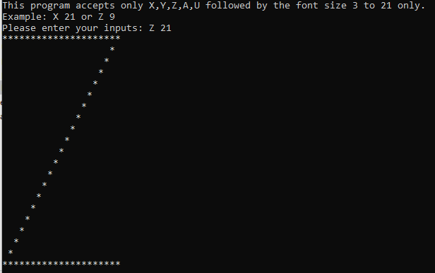

##Console Printer App
A simple console app that accepts 2 arguments: An alphabet and the size of the alphabet, and print out the alphabet on the console with the size specified.

## Getting Started
To get started, you will need to install [Git](https://git-scm.com/downloads). 

### Maven
Clone this repository using git into a directory of your choosing:
```shell
git clone https://github.com/joozybrain/printerapp.git
cd printerapp
```
You can compile and pacakge the application from the command line using:
```shell
mvnw clean package
```
Once the compilation is successful. You can execute the following command:
```shell
java -jar ./target/simplePrinter.jar
```
Follow the on-screen instructions as the app will validate your inputs to ensure you enter the correct arguments.
If your inputs are successful, you will see the following output.


